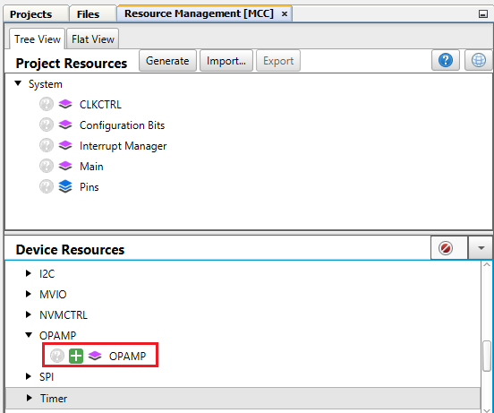
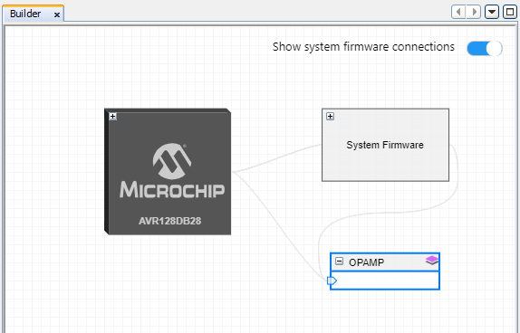
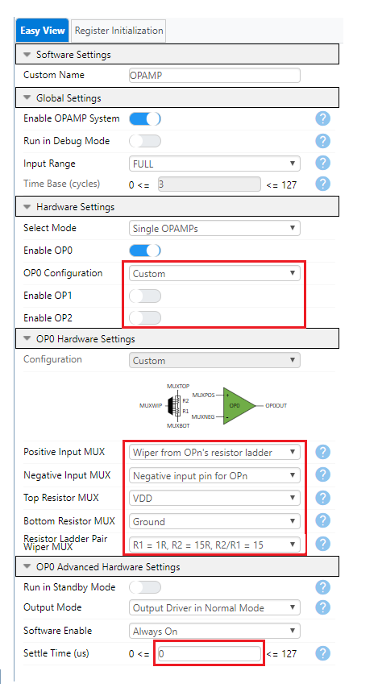
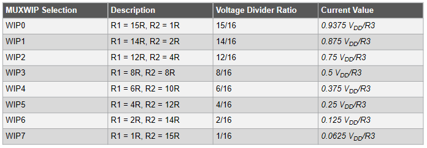
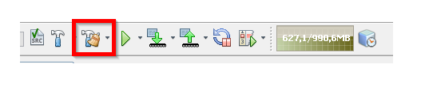
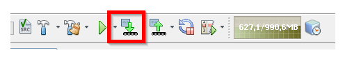

<!-- Please do not change this logo with link -->

# Constant-Current Driver Using the Analog Signal Conditioning (OPAMP) Peripheral

  

A new feature introduced in the AVR® DB MCU is the Analog Signal Conditioning (OPAMP) peripheral. In this example, the OPAMP is used as a constant-current driver using a single external resistor. It can be used to drive a load such as LEDs, with constant current and not constant voltage. The OPAMP peripheral also provides the ability to adjust the current setting under firmware control. The configuration for this example can be seen in the figure above. For more information about setup and code, see the [application note](https://microchip.com/DS00003632).

## Related Documentation

* [AN3632 - Constant-Current Driver Using the Analog Signal Conditioning (OPAMP) Peripheral](https://microchip.com/DS00003632)
* [AVR128DB48 Curiosity Nano User Guide](https://www.microchip.com/DS50003037)
* [AVR128DB48 Device Page](https://www.microchip.com/wwwproducts/en/AVR128DB48)

## Software Used

* [MPLAB® X](https://www.microchip.com/mplab/mplab-x-ide) v5.50 or later
* [MPLAB® Code Configurator (MCC)](https://www.microchip.com/mplab/mplab-code-configurator) 4.1.0 or newer
* [MPLAB® XC8 Compiler](https://www.microchip.com/mplab/compilers) v2.32 or later
* MPLABX AVR-Dx_DFP version 1.7.98 or later
* For the START based Microchip Studio version of this project, please go to [this repository](https://github.com/microchip-pic-avr-examples/avr128db48-constant-current-driver-using-opamp-studio-start)
  
## Hardware Used

* [AVR128DB48 Curiosity Nano](https://www.microchip.com/DevelopmentTools/ProductDetails/PartNO/EV35L43A)
* One resistor (value dependent on desired current)
* Load (LED, etc)

## Peripherals Configuration using MCC

### Added Peripherals

* Add the **OPAMP** Driver under **Device Resources** tab 

* The *Builder* tab shows the system, with the added **OPAMP** block

* Click on the **OPAMP** block, to enable the OPAMP driver configuration **Easy View** and configure as shown below

* Click on **Generate** in the **Resource Management** tab to generate the source code

## Setup
* Connect the load, such as an LED, between PD2 (OP0OUT) and PD3 (OP0INN) as shown in the schematic above

* Connect a resistor, R3, from PD3 (OP0INN) to GND. The value of R3 determines the amperage of the constant current. For instance, using R3 = 205Ω will yield a current of 1mA with this example implementation. See the [application note](https://microchip.com/DS00003632) for more information on how to configure R3 to produce a constant current with a specific amperage.

* To change the constant current level value in firmware with MCC, click on the **MCC** button in MPLAB X and click on the **OPAMP** peripheral under **Project Resources**. In the **OPAMP** tab, under **Easy Setup** find and click on the **OP0** tab. Use the drop down menu on the **MUXWIP: Multiplexer for Wiper Multiplexer** setting to change the amperage of the constant current according to the table below 

 

## Operation
* Connect the AVR128DB48 Curiosity Nano to a computer using a USB cable

* Download the "*.zip" file or clone this repository to get the source code

* Open the `avr128db48-constant-current-driver-using-opamp-mplab-mcc.X` project in MPLAB X

* Click the **clean and build** button to compile the code

* Click the **make and program** button to program the device

* If no tool has been chosen, a window will open, select the AVR128DB48 Curiosity Nano evaluation kit. The tool can also be chosen in the project settings. 

## Summary
After going through this example you should have a better understanding of how to set up the OPAMP peripheral as a constant current driver with a specific amperage for a load.

Also, If more precise control of the current value is required, the MCU’s digital-to-analog converter (DAC) can be internally connected to the non-inverting (+) input of the op amp, see the [application note](https://microchip.com/DS00003632) for more information

